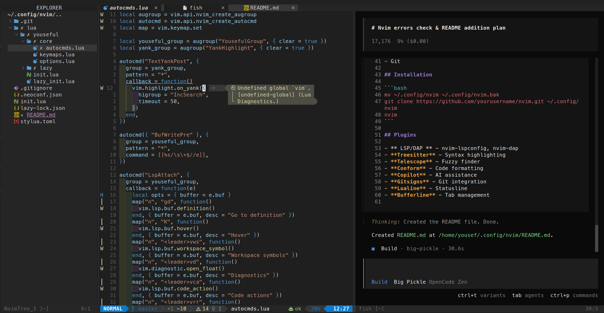

# Neovim Configuration

Personal Neovim configuration using lazy.nvim for plugin management.



## Structure

```
nvim/
├── init.lua                    # Entry point
├── lua/youseful/
│   ├── init.lua                # Main config loader
│   ├── lazy_init.lua          # Lazy plugin manager setup
│   ├── core/
│   │   ├── options.lua        # Vim options
│   │   ├── keymaps.lua        # Keybindings
│   │   └── autocmds.lua       # Autocommands
│   └── lazy/                  # Plugin configurations
│       ├── treesitter.lua
│       ├── lsp.lua
│       ├── telescope.lua
│       ├── conform.lua
│       └── ... (other plugins)
```

## Installation

- Make a backup of your current Neovim files:
  ```bash
  # required
  mv ~/.config/nvim{,.bak}

  # optional but recommended
  mv ~/.local/share/nvim{,.bak}
  mv ~/.local/state/nvim{,.bak}
  mv ~/.cache/nvim{,.bak}
  ```
- Clone the starter:
  ```bash
  git clone https://github.com/YousefSaad47/neoyouseful ~/.config/nvim
  ```
- Remove the .git folder, so you can add it to your own repo later:
  ```bash
  rm -rf ~/.config/nvim/.git
  ```
- Start Neovim:
  ```bash
  nvim
  ```
